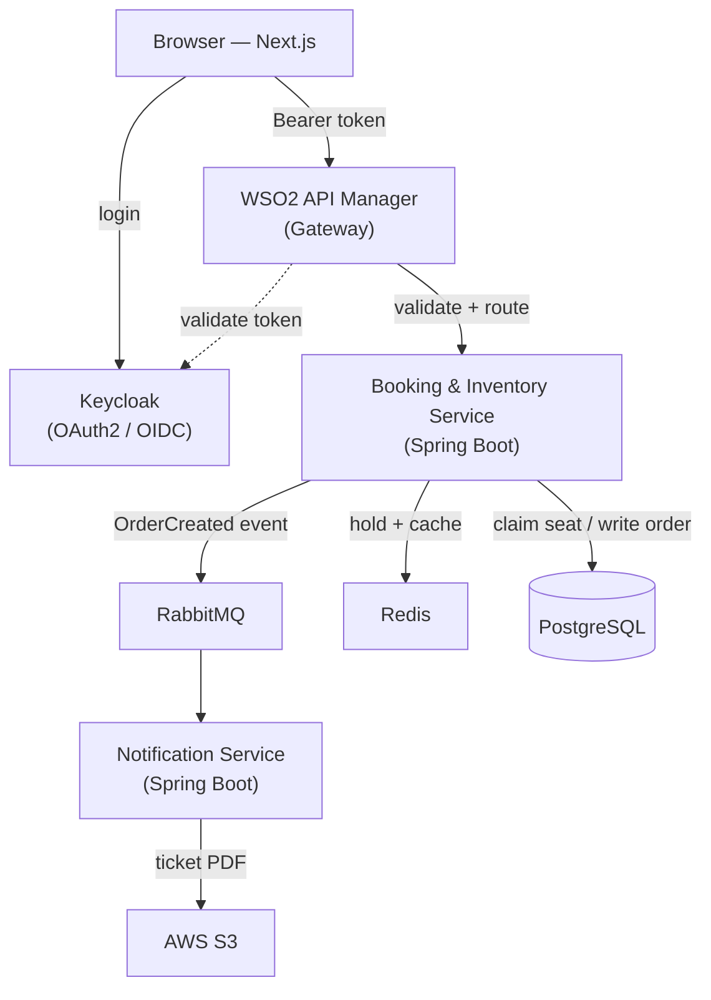

# 🎟️ ApexTick

**A distributed, real-time ticket reservation system built to survive a high-contention flash sale — thousands of users booking the same seats in the same second, with _zero double-booking_.**


---

## 📌 Overview

ApexTick simulates the moment a ticket drop goes live: five thousand fans rush to book the same seats in the same few seconds, and only one can win each seat. The entire system is engineered around a single hard problem:

> **When thousands of users try to book the same seat at the same instant, exactly one must succeed, the same seat must never be sold twice, and the system must stay fast and stay up.**

It is built as a deliberately right-sized **microservices architecture** with a modern enterprise stack — concurrency-safe booking, event-driven messaging, OAuth2 security, an API gateway, containerization, and Infrastructure as Code.

## ✨ Highlights

- **No double-booking under load** — correctness is enforced at the database with an atomic, lock-free seat claim, safe across many service instances (where an in-JVM lock would silently fail).
- **Hold-then-confirm flow** — seats are held with a TTL during checkout and auto-released if abandoned, just like real ticketing.
- **Event-driven** — successful bookings publish an `OrderCreated` event to RabbitMQ; a Notification service handles emails and ticket PDFs asynchronously, keeping the booking path fast.
- **Secured with OAuth2 / OIDC** — Keycloak issues JWTs; the API is a Spring Security resource server behind a WSO2 API Manager gateway that enforces rate limiting.
- **Proven at scale** — load-tested with thousands of concurrent virtual users, verifying every seat is sold exactly once.
- **Production-style DevOps** — one-command local environment with Docker Compose, infrastructure as code with Terraform, deployable to AWS.

## 🏗️ Architecture



## 🧰 Tech Stack

| Area | Technologies |
|---|---|
| **Backend** | Java 21, Spring Boot, Maven, Spring Data JPA, Spring Security |
| **Data** | PostgreSQL, Hibernate/JPA, Flyway (migrations) |
| **Identity & Edge** | Keycloak (OAuth2/OIDC), WSO2 API Manager (gateway) |
| **Messaging & Cache** | RabbitMQ, Redis |
| **Frontend** | Next.js, React, TanStack Query, Axios |
| **DevOps & Cloud** | Docker, docker-compose, Terraform, AWS (ECS, RDS, S3), Vercel |
| **Testing** | JUnit, Mockito, Testcontainers, k6 / Gatling |

## 🚀 Getting Started

### Prerequisites

- JDK 21
- Docker Desktop
- Node.js (for the frontend)

### Run locally

```bash
# Clone
git clone https://github.com/kalanas210/apextick.git
cd apextick

# Start infrastructure (PostgreSQL, and later RabbitMQ, Redis, Keycloak)
docker compose up -d

# Run the booking service
cd booking-service
./mvnw spring-boot:run
```

The booking service starts on `http://localhost:8080`.

## 📁 Project Structure

```text
apextick/
├── frontend/              # Next.js app
├── booking-service/       # Spring Boot — core booking & inventory (concurrency)
├── notification-service/  # Spring Boot — async event consumer
├── infra/                 # Terraform & docker configs
├── docs/                  # diagrams & full project document
├── docker-compose.yml
└── README.md
```

## Load Testing

The booking endpoint was load-tested with [k6](https://k6.io/) to validate correctness and performance under flash-sale contention.

**Scenario:** 5,000 concurrent booking attempts (200 virtual users) competing for 200 seats.

| Metric                            | Result        |
| --------------------------------- | ------------- |
| Seats sold (HTTP 200)             | 200 / 200     |
| Rejected — seat taken (HTTP 409)  | 4,800         |
| Double-bookings                   | 0             |
| Failed requests                   | 0.00%         |
| Throughput                        | ~3,900 req/s  |
| Latency p95 / p99                 | 146 / 224 ms  |

Every seat was sold exactly once — the number of successful holds equals the number of `HELD`
rows in the database, confirming the atomic conditional update eliminates double-booking even
under heavy concurrent load.

Reproduce: `k6 run load-test/booking-load-test.js` (stack up via `docker compose up`, seats seeded).

## 🗺️ Roadmap

- 🚧 **Phase A** — Core booking & inventory with concurrency-safe seat claiming (in progress)
- ⬜ **Phase B** — Keycloak auth + Next.js frontend
- ⬜ **Phase C** — RabbitMQ notification service + Redis holds/caching
- ⬜ **Phase D** — WSO2 API Manager gateway + load testing
- ⬜ **Phase E** — Terraform + AWS deployment

## 📖 Documentation

A full technical deep-dive — architecture, the concurrency model, the complete tech-stack rationale, and all diagrams — lives in [`docs/ApexTick-Project-Document.md`](docs/ApexTick-Project-Document.md).

---

<sub>Built as a portfolio project to demonstrate distributed systems, concurrency, and full-stack engineering.</sub>
