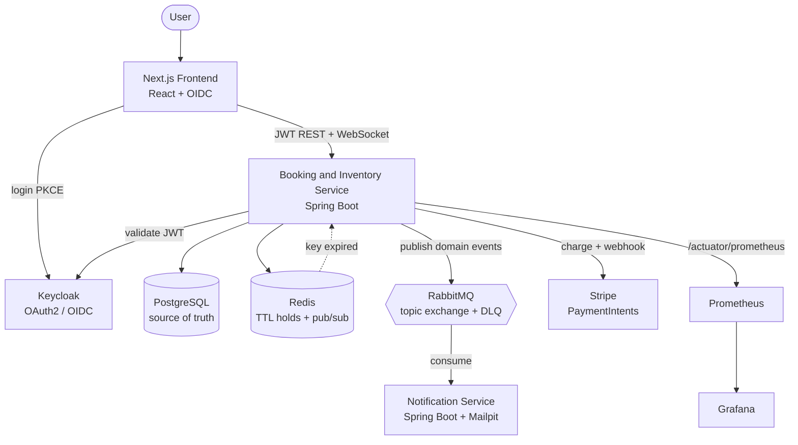

# ApexTick


> A distributed, real-time ticket reservation system built to survive a high-contention flash sale — where thousands of users race for the same seat and **exactly one** wins, with no double-booking and no slowdown.

ApexTick simulates the hardest moment in any ticketing platform: the instant a popular event goes on sale and a flood of requests collide on the same limited inventory. The whole system is designed around a single guarantee — **correctness under concurrency** — and that guarantee is *measured*, not assumed.

## Proven under load

An authenticated [k6](https://k6.io) test logs into Keycloak, then fires **5,000 hold attempts from 200 concurrent virtual users** at an event with exactly **300 seats**:

| Metric | Result |
| --- | --- |
| Concurrent virtual users | 200 |
| Total hold attempts | 5,000 |
| Seats available | 300 |
| **Holds won** | **300 / 300** |
| Holds correctly rejected | 4,700 |
| **Double-bookings** | **0** |
| Failed requests | **0.00 %** |
| Throughput | ~1,860 req/s |
| Latency (p95) | 233 ms |
| Latency (p99) | 373 ms |

Every seat was sold exactly once. Every losing request received a clean `409`. No seat was ever held by two people at the same time — and the test *proves* it by reading the service's own seat map back after the storm (`held == 300`, `available == 0`). Numbers from a single local instance against dockerised infrastructure; see [Load testing](#load-testing).

## Architecture



Two independent services share a **message contract, not code**:

- **Booking & Inventory Service** — the secured REST + WebSocket API. It claims seats atomically, records holds, orders, payments and tickets, publishes domain events through a transactional outbox, and drives hold expiry.
- **Notification Service** — a fully independent consumer with its **own database**. It reacts to booking events asynchronously and can restart or fail without affecting bookings.

Supporting infrastructure: **PostgreSQL** (source of truth), **Redis** (self-expiring holds + realtime fan-out), **RabbitMQ** (event bus with dead-letter queues), **Keycloak** (OAuth2 / OIDC), **Stripe** (payments), and **Prometheus + Grafana** (observability).

## How the concurrency works

The heart of the system is a single atomic statement:

```sql
UPDATE seats
   SET status = 'HELD',
       held_by = :userId,
       held_until = :expiry
 WHERE id = :seatId
   AND status = 'AVAILABLE';
```

When hundreds of requests target the same seat at once, they all run this `UPDATE`. PostgreSQL serializes them against that one row: the first to commit flips the seat to `HELD` and affects **1 row**; every other request now fails the `status = 'AVAILABLE'` condition and affects **0 rows**. The service simply reads the affected-row count — `1` means the seat is yours, `0` means it was already taken.

There are no `synchronized` blocks, no application-level mutexes, and no distributed locks. **The row in the database is the synchronization point**, which means the guarantee holds no matter how many copies of the service are running. This is the single most important decision in the project: *correctness lives in the shared database, not in any one JVM.*

## What's inside

| Capability | How it works |
| --- | --- |
| **Atomic seat holds** | Conditional `UPDATE ... WHERE status='AVAILABLE'`; multi-seat holds are all-or-nothing. |
| **Self-expiring holds** | Each hold is a Redis key with a TTL; a keyspace-expiry notification releases the seat. A DB sweeper is the fallback for lost notifications. |
| **Live seat map** | WebSocket / STOMP (`/api/ws`) with Redis pub/sub fan-out, so every browser sees a seat flip in real time — across multiple service instances. |
| **Orders** | Idempotent order creation (`Idempotency-Key`), a payment window, and a sweeper that expires unpaid orders and releases their seats. |
| **Payments** | Pluggable `PaymentGateway` — **mock** (offline, deterministic test cards), **Stripe** (PaymentIntents + signed webhook + refund), PayHere scaffolded. Switch with `APP_PAYMENT_PROVIDER`. |
| **Tickets** | On payment, a QR-tokened ticket is issued per seat; admins verify tickets at the gate. |
| **Transactional outbox** | Domain events are written in the same transaction as the state change and published to RabbitMQ only after commit — no phantom events on rollback. |
| **Async notifications** | An independent service consumes booking events (idempotently, with a DLQ) and sends templated email via Mailpit/SMTP. |
| **Admin API** | Events & layout management, live event stats, orders, seat release, ticket verification — all `ROLE_ADMIN`. |
| **Rate limiting** | Redis fixed-window limits on hold/order/pay, returning `429` + `Retry-After`. |
| **Observability** | Micrometer → Prometheus, with a provisioned Grafana dashboard. |
| **Errors** | RFC-7807 `application/problem+json` everywhere, with a correlation id per request. |

## Engineering highlights

- **Lock-free atomic concurrency**, proven at 300/300 holds with zero double-bookings under load.
- **Self-expiring holds** — a held seat is written to Redis with a TTL. When the key expires, a Redis keyspace notification triggers the seat's release back to `AVAILABLE` — no polling loop on the happy path.
- **Event-driven decoupling** — the booking service writes to a **transactional outbox** and publishes to a RabbitMQ topic exchange after commit; the notification service consumes independently, idempotently, with a dead-letter queue for poison messages.
- **PCI-conscious payments** — the Stripe adapter never sees a raw card number: it creates a PaymentIntent and returns a `client_secret` for the browser to confirm, treating the signed `payment_intent.succeeded` webhook as the source of truth. Webhooks are idempotent, and a charge that lands after its seats were lost is automatically refunded.
- **Stateless JWT security** — Keycloak issues OIDC tokens the API validates statelessly; roles map from `realm_access.roles` to `ROLE_*`. Auth keeps working containerized by fetching signing keys over the internal network while validating the public issuer.
- **One-command infrastructure** — the whole backend, its dependencies, the Keycloak realm, and an optional observability stack start with `docker compose up`. Every secret is externalized to a git-ignored `.env`.
- **Verified** — 51 tests, most of them full-stack **Testcontainers** integration tests covering concurrency, expiry, the outbox, orders, payments, webhooks, admin, security and rate-limiting.

## Tech stack

| Layer | Technology | Why |
| --- | --- | --- |
| Language | Java 21 | Records, pattern matching, modern language features |
| Framework | Spring Boot | Production-grade REST, security, data, messaging, WebSocket |
| Database | PostgreSQL | ACID guarantees underpin the concurrency model |
| Migrations | Liquibase | Versioned, reviewable schema changes |
| Cache / TTL / pub-sub | Redis | Self-expiring holds + realtime fan-out |
| Messaging | RabbitMQ | Reliable event delivery with dead-letter queues |
| Auth | Keycloak | Standard OAuth2 / OIDC, portable across providers |
| Payments | Stripe | PaymentIntents, webhooks, refunds (mock provider for offline demos) |
| Observability | Micrometer + Prometheus + Grafana | Metrics, scraping, dashboards |
| Frontend | Next.js (React) | App Router, OIDC login, live seat map |
| Load testing | k6 | Scriptable concurrency + correctness verification |
| Containerization | Docker Compose | Reproducible, one-command environment |

## Getting started

### Prerequisites

- Docker Desktop
- Node.js 20+ (only for the frontend)
- (Optional) [k6](https://k6.io) for the load test

### 1. Clone and configure

```bash
git clone https://github.com/kalanas210/apextick.git
cd apextick
cp .env.example .env   # defaults are fine for local development
```

### 2. Start the backend and infrastructure

```bash
docker compose up --build
```

This launches the Booking & Inventory Service and Notification Service together with PostgreSQL, Redis, RabbitMQ, Mailpit, and Keycloak. **The `apextick` realm — client, roles, and a demo user — is imported automatically**; no manual Keycloak setup is required. Demo data (series, events, teams, and seats) is seeded by Liquibase on first start.

Default demo login: **`kalana` / `12345`**.

### 3. Explore the API

Interactive OpenAPI docs (Swagger UI) are served at **http://localhost:8081/swagger-ui.html**. Use **Authorize** to paste a Keycloak access token, then try the secured endpoints from the browser.

Grab a token from the command line via the direct-grant flow:

```bash
curl -s http://localhost:8180/realms/apextick/protocol/openid-connect/token \
  -d grant_type=password -d client_id=apextick-web \
  -d username=kalana -d password=12345 | jq -r .access_token
```

### 4. (Optional) Run the frontend

```bash
cd frontend
npm ci
npm run dev
```

Open **http://localhost:3000**, log in, and book a seat.

## Payments

The active gateway is chosen by `APP_PAYMENT_PROVIDER` (`mock` by default):

- **`mock`** — offline and deterministic. Test cards: `4242 4242 4242 4242` succeeds, `4000 0000 0000 0002` is declined, `4000 0000 0000 9995` is insufficient-funds.
- **`stripe`** — set `STRIPE_SECRET_KEY`, `STRIPE_PUBLISHABLE_KEY`, and `STRIPE_WEBHOOK_SECRET` in `.env`. The browser confirms a PaymentIntent with Stripe.js; forward webhooks locally with the [Stripe CLI](https://stripe.com/docs/stripe-cli):

  ```bash
  stripe listen --forward-to localhost:8081/api/payments/stripe/webhook
  ```

  For a quick server-side smoke test (no frontend), pay with a test PaymentMethod:

  ```bash
  curl -X POST localhost:8081/api/orders/<ORDER_ID>/pay \
    -H "Authorization: Bearer <TOKEN>" -H "Content-Type: application/json" \
    -d '{"paymentMethodId":"pm_card_visa"}'
  ```

`GET /api/payments/config` tells the frontend which provider is active and returns the Stripe publishable key.

## Observability

Bring up Prometheus and Grafana alongside the stack:

```bash
docker compose --profile observability up
```

| Tool | URL | Notes |
| --- | --- | --- |
| Prometheus | http://localhost:9090 | Scrapes `booking-service:8081/actuator/prometheus` every 5 s |
| Grafana | http://localhost:3001 | Login `admin` / `admin`; the **ApexTick — Booking Service** dashboard is auto-provisioned |

The dashboard visualises the flash sale directly from HTTP metrics: seat-hold outcomes (200 won vs 409 rejected), request throughput per endpoint, p50/p95/p99 latency, the HikariCP connection pool, and JVM heap/threads/CPU. Run the load test with the profile up to watch it move.

## Load testing

The k6 script authenticates against Keycloak and drives the real, JWT-secured hold endpoint. It discovers the target event's available seats automatically, so no seat ids are hard-coded.

```bash
cd load-test
k6 run booking-load-test.js
# tune anything via env:
k6 run -e VUS=200 -e ITERATIONS=5000 -e EVENT_SLUG=india-australia-semi-final booking-load-test.js
```

After the run, `teardown` reads the seat map back and asserts every targeted seat is now `HELD` and none is left `AVAILABLE` — the invariant is a threshold, so a correctness violation fails the run. Re-running needs the seats reset (restart with a fresh volume, or release the holds).

## Testing

```bash
cd booking-service
./mvnw verify   # needs Docker for Testcontainers
```

51 tests run, most of them full-stack Testcontainers integration tests: seat concurrency (1 winner / 199 losers), multi-seat all-or-nothing holds, Redis-driven expiry, the hold sweeper, the transactional outbox, the order/payment flow, Stripe signature verification and mapping, seats-lost compensation, the admin API, security, and rate limiting.

## Project structure

```
apextick/
├── booking-service/        # Spring Boot — seats, holds, orders, payments, tickets, admin
├── notification-service/   # Spring Boot — independent RabbitMQ consumer, own DB, email
├── frontend/               # Next.js — seat map UI with OIDC login
├── load-test/              # k6 authenticated flash-sale + correctness test
├── keycloak/import/        # auto-imported apextick realm (client, roles, demo user)
├── infra/                  # Prometheus + Grafana provisioning, Terraform (AWS)
├── caddy/                  # TLS edge reverse proxy
├── docker-compose.yml      # Full stack + optional `observability` profile
└── .env.example            # Template for required environment variables
```

## Ports

| Service | URL / Port |
| --- | --- |
| Booking & Inventory API | http://localhost:8081 |
| Frontend | http://localhost:3000 |
| Keycloak | http://localhost:8180 |
| RabbitMQ management | http://localhost:15672 |
| Mailpit (email inbox) | http://localhost:8025 |
| Grafana *(observability profile)* | http://localhost:3001 |
| Prometheus *(observability profile)* | http://localhost:9090 |
| PostgreSQL | localhost:5440 |
| Redis | localhost:6379 |

## Roadmap

- Ticket PDF generation with embedded QR, stored in S3/MinIO and attached to emails
- Frontend checkout with Stripe Elements + account/tickets pages
- PayHere sandbox adapter (enum and config are already scaffolded)
- WSO2 API Manager in front of the services (opt-in compose profile)

---

Built by [Kalana Sandakelum](https://github.com/kalanas210).
