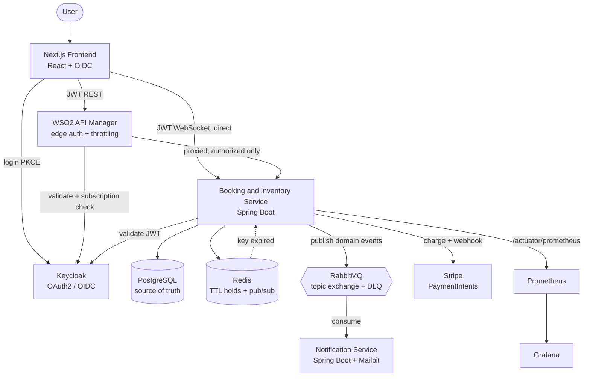

# ApexTick


> A distributed, real-time ticket reservation system built to survive a high-contention flash sale — where thousands of users race for the same seat and **exactly one** wins, with no double-booking and no slowdown.

ApexTick simulates the hardest moment in any ticketing platform: the instant a popular event goes on sale and a flood of requests collide on the same limited inventory. The whole system is designed around a single guarantee — **correctness under concurrency** — and that guarantee is *measured*, not assumed.

## Proven under load

An authenticated [k6](https://k6.io) test fires **5,000 hold attempts from 200 concurrent virtual users** at an event with exactly **300 seats**. Every virtual user logs into Keycloak as its *own* account, so this is 200 buyers, not 200 threads sharing one login — which is what makes "no seat was held by two people" a statement about people:

| Metric | Result |
| --- | --- |
| Concurrent virtual users | 200 (one Keycloak identity each) |
| Total hold attempts | 5,000 |
| Seats available | 300 |
| **Holds won** | **300 / 300** |
| Holds correctly rejected | 4,700 |
| **Double-bookings** | **0** |
| Failed requests | **0.00 %** |
| Throughput | ~1,860 req/s |
| Latency (p95) | 233 ms |
| Latency (p99) | 373 ms |

Every seat was sold exactly once. Every losing request received a clean `409`. No seat was ever held by two people at the same time — and the test *proves* it by reading the service's own seat map back after the storm (`held == 300`, `available == 0`, and every seat's optimistic-lock `version` moved by exactly 1). Numbers from a single local instance against dockerised infrastructure; [Load testing](#load-testing) has the exact commands, including the one-off step that seeds the 200 accounts.

## Architecture



Two independent services share a **message contract, not code**:

- **Booking & Inventory Service** — the secured REST + WebSocket API. It claims seats atomically, records holds, orders, payments and tickets, publishes domain events through a transactional outbox, and drives hold expiry.
- **Notification Service** — a fully independent consumer with its **own database**. It reacts to booking events asynchronously and can restart or fail without affecting bookings.

Supporting infrastructure: **PostgreSQL** (source of truth), **Redis** (self-expiring holds + realtime fan-out), **RabbitMQ** (event bus with dead-letter queues), **Keycloak** (OAuth2 / OIDC), **WSO2 API Manager** (edge authentication, subscription enforcement, and — in production — the front door for every REST call), **Stripe** (payments), and **Prometheus + Grafana** (observability). The WebSocket stays on a direct route to the service; see [API gateway](#api-gateway) for why.

## How the concurrency works

The heart of the system is a single atomic statement:

```sql
UPDATE seats
   SET status = 'HELD',
       held_by = :userId,
       held_until = :expiry
 WHERE id = :seatId
   AND status = 'AVAILABLE';
```

When hundreds of requests target the same seat at once, they all run this `UPDATE`. PostgreSQL serializes them against that one row: the first to commit flips the seat to `HELD` and affects **1 row**; every other request now fails the `status = 'AVAILABLE'` condition and affects **0 rows**. The service simply reads the affected-row count — `1` means the seat is yours, `0` means it was already taken.

There are no `synchronized` blocks, no application-level mutexes, and no distributed locks. **The row in the database is the synchronization point**, which means the guarantee holds no matter how many copies of the service are running. This is the single most important decision in the project: *correctness lives in the shared database, not in any one JVM.*

## What's inside

| Capability | How it works |
| --- | --- |
| **Atomic seat holds** | Conditional `UPDATE ... WHERE status='AVAILABLE'`; multi-seat holds are all-or-nothing. |
| **Self-expiring holds** | Each hold is a Redis key with a TTL; a keyspace-expiry notification releases the seat. A DB sweeper is the fallback for lost notifications. |
| **Live seat map** | WebSocket / STOMP (`/api/ws`) with Redis pub/sub fan-out, so every browser sees a seat flip in real time — across multiple service instances. |
| **Orders** | Idempotent order creation (`Idempotency-Key`), a payment window, and a sweeper that expires unpaid orders and releases their seats. |
| **Payments** | Pluggable `PaymentGateway` — **mock** (offline, deterministic test cards) and **Stripe** (PaymentIntents + signed webhook + refund). Switch with `APP_PAYMENT_PROVIDER`. |
| **Tickets** | On payment a QR-tokened ticket is issued per seat, rendered to a PDF and cached in S3/MinIO (off the payment path, regenerated on demand); admins verify tickets at the gate. |
| **Transactional outbox** | Domain events are written in the same transaction as the state change and published to RabbitMQ only after commit — no phantom events on rollback. |
| **Async notifications** | An independent service consumes booking events (idempotently, with a DLQ) and sends templated email via Mailpit/SMTP. |
| **Admin panel** | A `/admin` area behind the `admin` realm role: event CRUD, a one-shot seating-layout builder with a live seat/revenue preview, live event stats, an orders console, seat release, and a gate scanner that reads QR codes with the browser's own `BarcodeDetector`. |
| **Admin API** | Events & layout management, live event stats, orders, seat release, ticket verification — all `ROLE_ADMIN`. |
| **Rate limiting** | Redis fixed-window limits on hold/order/pay, returning `429` + `Retry-After`. |
| **Observability** | Micrometer → Prometheus, with a provisioned Grafana dashboard. |
| **Errors** | RFC-7807 `application/problem+json` everywhere, with a correlation id per request. |

## Engineering highlights

- **Lock-free atomic concurrency**, proven at 300/300 holds with zero double-bookings under load.
- **Self-expiring holds** — a held seat is written to Redis with a TTL. When the key expires, a Redis keyspace notification triggers the seat's release back to `AVAILABLE` — no polling loop on the happy path.
- **Event-driven decoupling** — the booking service writes to a **transactional outbox** and publishes to a RabbitMQ topic exchange after commit; the notification service consumes independently, idempotently, with a dead-letter queue for poison messages.
- **PCI-conscious payments** — the Stripe adapter never sees a raw card number: it creates a PaymentIntent and returns a `client_secret` for the browser to confirm, treating the signed `payment_intent.succeeded` webhook as the source of truth. Webhooks are idempotent, and a charge that lands after its seats were lost is automatically refunded.
- **Stateless JWT security** — Keycloak issues OIDC tokens the API validates statelessly; roles map from `realm_access.roles` to `ROLE_*`. Auth keeps working containerized by fetching signing keys over the internal network while validating the public issuer.
- **One-command infrastructure** — the whole backend, its dependencies, the Keycloak realm, and an optional observability stack start with `docker compose up`. Every secret, including the realm's client secrets, comes from a git-ignored `.env`, and the production stack refuses to start while any credential is unset.
- **Verified** — 157 booking-service tests, most of them full-stack **Testcontainers** integration tests covering concurrency, expiry, the outbox, orders, payments, webhooks, admin, security and rate-limiting; GreenMail tests for the notification service's SMTP path (an authenticated login, and refusing a server that doesn't offer STARTTLS); Vitest unit tests for the frontend's money and status helpers, and for the admin hooks' bearer tokens and cache keys. CI also fails when the gateway's OpenAPI contract drifts from the code.

## Tech stack

| Layer | Technology | Why |
| --- | --- | --- |
| Language | Java 21 | Records, pattern matching, modern language features |
| Framework | Spring Boot | Production-grade REST, security, data, messaging, WebSocket |
| Database | PostgreSQL | ACID guarantees underpin the concurrency model |
| Migrations | Liquibase | Versioned, reviewable schema changes |
| Cache / TTL / pub-sub | Redis | Self-expiring holds + realtime fan-out |
| Messaging | RabbitMQ | Reliable event delivery with dead-letter queues |
| Auth | Keycloak | Standard OAuth2 / OIDC, portable across providers |
| API Gateway | WSO2 API Manager | Edge auth, subscription enforcement, throttling — a published contract instead of a bare service |
| Payments | Stripe | PaymentIntents, webhooks, refunds (mock provider for offline demos) |
| Observability | Micrometer + Prometheus + Grafana | Metrics, scraping, dashboards |
| Frontend | Next.js (React) | App Router, OIDC login, live seat map |
| Load testing | k6 | Scriptable concurrency + correctness verification |
| Containerization | Docker Compose | Reproducible, one-command environment |

## Getting started

### Prerequisites

- Docker Desktop
- Node.js 20+ (only for the frontend)
- (Optional) [k6](https://k6.io) for the load test

### 1. Clone and configure

```bash
git clone https://github.com/kalanas210/apextick.git
cd apextick
cp .env.example .env   # defaults are fine for local development
```

### 2. Start the backend and infrastructure

```bash
docker compose up --build
```

This launches the Booking & Inventory Service and Notification Service together with PostgreSQL, Redis, RabbitMQ, Mailpit, and Keycloak. **The `apextick` realm — client, roles, and a demo user — is imported automatically**; no manual Keycloak setup is required. Demo data (series, events, teams, and seats) is seeded by Liquibase on first start.

Default demo login: **`kalana` / `12345`**.

### 3. Explore the API

Interactive OpenAPI docs (Swagger UI) are served at **http://localhost:8081/swagger-ui.html**. Use **Authorize** to paste a Keycloak access token, then try the secured endpoints from the browser.

Grab a token from the command line with the password grant. The SPA's own
client (`apextick-web`) is public and only does authorization code + PKCE, so
this goes through the confidential `apextick-loadtest` client, whose secret is
`LOADTEST_CLIENT_SECRET` in `.env`:

```bash
LOADTEST_CLIENT_SECRET=$(sed -n 's/^LOADTEST_CLIENT_SECRET=//p' .env)
: "${LOADTEST_CLIENT_SECRET:=dev-loadtest-secret}"   # docker-compose.yml's fallback, for an older .env
curl -s http://localhost:8180/realms/apextick/protocol/openid-connect/token \
  -d grant_type=password -d client_id=apextick-loadtest \
  -d "client_secret=$LOADTEST_CLIENT_SECRET" \
  -d username=kalana -d password=12345 | jq -er .access_token
```

### 4. (Optional) Run the frontend

```bash
cd frontend
npm ci
npm run dev
```

Open **http://localhost:3000**, log in, and book a seat. Sign-in, the seat map,
holds, checkout and tickets all run against the live API.

The frontend finds the API automatically (same-origin behind Caddy, `:8081` locally).
If that port is taken, point it somewhere else:

```bash
NEXT_PUBLIC_API_URL=http://localhost:18081 npm run dev
```

### 5. (Optional) Open the admin panel

**http://localhost:3000/admin** — event CRUD, the seating-layout builder, live
stats, the orders console, seat release, and the gate scanner.

It is gated on the `admin` realm role. The realm **defines** that role but
grants it to nobody: the seeded `kalana` account is a plain customer, and its
password is published here, so making it an administrator would hand
`/api/admin/**` to anyone who can read this file. Grant the role deliberately,
to whoever should hold it:

```bash
scripts/grant-admin.sh                 # grants to kalana
scripts/grant-admin.sh someone-else
```

The script patches the realm through Keycloak's Admin API, so it works on a
stack that is already running — which matters, because Keycloak reads
`keycloak/import/apextick-realm.json` only when the realm does not yet exist in
its database, and recreating the container to force a re-import would drop every
account registered since.

Realm roles are baked into the access token when it is issued, so sign out and
back in afterwards.

On a deployment anyone else can reach, change the demo password too — it is a
seed for local development, not a credential.

The gate scanner reads QR codes through the browser's native `BarcodeDetector`
(Chromium, on a secure origin — HTTPS or `localhost`); everywhere else it falls
back to pasting the token, which is also how it is demoed without a camera.

## Payments

The active gateway is chosen by `APP_PAYMENT_PROVIDER` (`mock` by default):

- **`mock`** — offline and deterministic. Test cards: `4242 4242 4242 4242` succeeds, `4000 0000 0000 0002` is declined, `4000 0000 0000 9995` is insufficient-funds.
- **`stripe`** — set `STRIPE_SECRET_KEY`, `STRIPE_PUBLISHABLE_KEY`, and `STRIPE_WEBHOOK_SECRET` in `.env`. The browser confirms a PaymentIntent with Stripe.js; forward webhooks locally with the [Stripe CLI](https://stripe.com/docs/stripe-cli):

  ```bash
  stripe listen --forward-to localhost:8081/api/payments/stripe/webhook
  ```

  For a quick server-side smoke test (no frontend), pay with a test PaymentMethod:

  ```bash
  curl -X POST localhost:8081/api/orders/<ORDER_ID>/pay \
    -H "Authorization: Bearer <TOKEN>" -H "Content-Type: application/json" \
    -d '{"paymentMethodId":"pm_card_visa"}'
  ```

`GET /api/payments/config` tells the frontend which provider is active and returns the Stripe publishable key.

## Observability

Bring up Prometheus and Grafana alongside the stack:

```bash
docker compose --profile observability up
```

| Tool | URL | Notes |
| --- | --- | --- |
| Prometheus | http://localhost:9090 | Scrapes `booking-service:8081/actuator/prometheus` every 5 s |
| Grafana | http://localhost:3001 | Login `admin` / `admin`; the **ApexTick — Booking Service** dashboard is auto-provisioned |

The dashboard visualises the flash sale directly from HTTP metrics: seat-hold outcomes (`201` won vs `409` rejected — selected on `method="POST"`, since releasing a hold is a `DELETE` on the same URI template), request throughput per endpoint, p50/p95/p99 latency, the HikariCP connection pool, and JVM heap/threads/CPU. Run the load test with the profile up to watch it move.

## Load testing

The k6 script drives the real, JWT-secured hold endpoint the SPA uses, `POST /api/events/{slug}/holds`. It discovers the target event's seats through the admin API, so no seat ids are hard-coded — which is also why it needs an admin account as well as a buyer.

Everyone logs in with the password grant on the confidential `apextick-loadtest` client. There are no built-in credentials; the script refuses to start without all five:

| Variable | What it is |
| --- | --- |
| `LOADTEST_USER` / `LOADTEST_PASSWORD` | a buyer account — and the password every pool account shares |
| `LOADTEST_CLIENT_SECRET` | `apextick-loadtest`'s secret, from `.env` |
| `LOADTEST_ADMIN_USER` / `LOADTEST_ADMIN_PASSWORD` | an account with the `admin` realm role — `teardown` reads `/api/admin/seats` with it to check holders and versions. Grant it once with `scripts/grant-admin.sh <user>` |

**One virtual user is one person.** Each VU logs in as its own Keycloak account, so `VUS` is capped to the size of the identity pool — the per-user rate limiter, the per-user seat cap and `held_by` all then behave like a real crowd. Seed the pool once (idempotent):

```bash
cd load-test
export LOADTEST_PASSWORD=12345
./seed-loadtest-users.sh 200            # creates loadtest-01 … loadtest-200 in the realm
```

Seeding runs two Keycloak admin calls per account, so 200 of them take a few minutes — once, not per run.

```bash
export LOADTEST_USER=kalana LOADTEST_PASSWORD=12345
export LOADTEST_ADMIN_USER=kalana LOADTEST_ADMIN_PASSWORD=12345
export LOADTEST_CLIENT_SECRET=$(sed -n 's/^LOADTEST_CLIENT_SECRET=//p' ../.env)
: "${LOADTEST_CLIENT_SECRET:=dev-loadtest-secret}"   # docker-compose.yml's fallback, for an older .env
k6 run -e LOADTEST_USER_COUNT=200 booking-load-test.js
# tune anything via env:
k6 run -e LOADTEST_USER_COUNT=200 -e ITERATIONS=5000 -e EVENT_SLUG=india-australia-semi-final booking-load-test.js
```

The storm itself lasts seconds, but `setup` logs all 200 accounts in before the first hold and Keycloak hashes passwords slowly, so expect a quiet minute first — the script raises k6's 60-second setup allowance to match the pool size.

**How big must the pool be?** Two service-side limits set the floor, and the script computes both instead of assuming:

- **`app.hold.max-seats`** caps how many seats *one person* may hold on *one event* (default 8), so N accounts can win at most `N × 8` seats. Selling out 300 seats needs `ceil(300 / 8) = 38` accounts. Below that a sell-out is arithmetically impossible, and the script says so rather than failing: it drops to a "capped run" that still proves no double-booking, no stranger holding a seat and no identity over the cap. A request from someone already at their cap answers `422 TOO_MANY_SEATS`, which is counted in `holds_capped` as a correct rejection, not a failed request. `setup` probes the running service for the real cap and refuses to start if it disagrees with the run's arithmetic.
- **`app.rate-limit.hold.limit`** allows 30 holds per subject per minute, and the 5,000 attempts land in about three seconds — so each account gets ~30, full stop. Covering 300 seats with random draws needs roughly `300 × ln(300) ≈ 1,700` attempts to even *reach* every seat, which is why `ITERATIONS` stays at 5,000; that in turn wants `5000 / 30 ≈ 167` accounts. 200 clears it, and `setup` warns when the pool is small enough to be throttled.

A smaller pool works if you lift the limiter for the run instead:

```bash
./seed-loadtest-users.sh 40
(cd .. && APP_RATE_LIMIT_HOLD_LIMIT=100000 docker compose up -d booking-service)
k6 run -e LOADTEST_USER_COUNT=40 booking-load-test.js
```

`APP_RATE_LIMIT_ENABLED`, `APP_RATE_LIMIT_HOLD_LIMIT`, `APP_RATE_LIMIT_HOLD_WINDOW` and `APP_HOLD_MAX_SEATS` are declared in `docker-compose.yml` at their `application.yml` defaults, so overriding them from the shell or `.env` actually reaches the container — Compose forwards nothing a service has not declared.

After the run, `teardown` reads the seat map back and asserts every targeted seat is `HELD`, none is left `AVAILABLE`, every holder is one of the pool identities, no identity is over the cap, and every seat's optimistic-lock `version` moved by exactly 1 — a seat two people both won would have been written twice. The invariants are k6 checks under a `rate==1.0` threshold, so a correctness violation fails the run. Re-running needs the seats reset (restart with a fresh volume, or release the holds).

## Testing

```bash
(cd booking-service && ./mvnw verify)        # needs Docker for Testcontainers
(cd notification-service && ./mvnw verify)
(cd frontend && npm ci --ignore-scripts && npm test)
```

booking-service runs 157 tests, most of them full-stack Testcontainers integration tests: seat concurrency (1 winner / 199 losers) over the real hold endpoint, multi-seat all-or-nothing holds, the sales window and per-user seat cap, Redis-driven expiry, the hold sweeper, the transactional outbox, the order/payment flow, Stripe signature verification and mapping, seats-lost compensation, the admin API, security, and rate limiting. Its verify also exports the served OpenAPI document to `target/openapi/api-docs.json`, which CI normalises and compares with the committed gateway contract. notification-service runs 8 (GreenMail, including an authenticated SMTP server and one that refuses STARTTLS); the frontend runs 68 Vitest unit tests.

## Project structure

```
apextick/
├── booking-service/        # Spring Boot — seats, holds, orders, payments, tickets, admin
├── notification-service/   # Spring Boot — independent RabbitMQ consumer, own DB, email
├── frontend/               # Next.js — live seat map, checkout, orders, tickets, /admin panel
├── load-test/              # k6 authenticated flash-sale + correctness test
├── keycloak/import/        # auto-imported apextick realm (client, roles, demo user)
├── scripts/                # WSO2 gateway setup, grant-admin.sh
├── infra/                  # Prometheus + Grafana provisioning, Terraform (AWS)
├── caddy/                  # TLS edge reverse proxy
├── wso2/                   # API Manager config + the published API contract
├── docker-compose.yml      # Full local stack + optional `observability` profile
├── docker-compose.prod.yml # Deployment stack: GHCR images behind Caddy
└── .env.example            # Template for required environment variables
```

## Ports

| Service | URL / Port |
| --- | --- |
| Booking & Inventory API | http://localhost:8081 |
| Frontend | http://localhost:3000 |
| Keycloak | http://localhost:8180 |
| RabbitMQ management | http://localhost:15672 |
| Mailpit (email inbox) | http://localhost:8025 |
| MinIO console (ticket PDFs) | http://localhost:9001 |
| Grafana *(observability profile)* | http://localhost:3001 |
| Prometheus *(observability profile)* | http://localhost:9090 |
| WSO2 gateway *(wso2 profile)* | http://localhost:8280/api |
| WSO2 portals *(wso2 profile)* | https://localhost:9443/publisher |
| PostgreSQL | localhost:5440 |
| Redis | localhost:6379 |

## Deployment

CI builds the three service images and pushes them to GHCR once the test run for
that commit is green; the production stack pulls those tags.

```bash
cp .env.example .env            # set SERVER_IP, every credential, Stripe keys
docker compose -f docker-compose.prod.yml up -d
```

The production file has no fallback for any credential: it refuses to start
until `.env` sets the database, RabbitMQ, Keycloak admin, MinIO, WSO2 and
Grafana passwords and the two realm client secrets (`WSO2_KM_CLIENT_SECRET`,
`LOADTEST_CLIENT_SECRET`). The check only catches a missing value, so replace
every `changeme`, `minioadmin`, `admin` and `dev-*` value with
`openssl rand -hex 32`.

Caddy is the only thing published (80/443). It terminates TLS with an
automatically-provisioned certificate for `https://<SERVER_IP>.nip.io` and routes
by path — `/api` to the WSO2 gateway (which then reaches the booking service),
the apextick realm's `/realms`, `/resources` and `/js` to Keycloak (minus the
master realm and the client-registration API), everything else (including the
`/admin` panel) to the frontend. The security group in
`infra/` opens only 80/443 to the world and SSH to `admin_cidr`, a required
Terraform variable:

```bash
cd infra && terraform apply -var admin_cidr=<your-ip>/32
```

Keycloak's own admin console is not published. Reach it over an SSH tunnel to
its loopback-only port (`ssh -L 8180:localhost:8180 ubuntu@<host>`) after the
`kcadm` step described next to the keycloak service in
`docker-compose.prod.yml`, repeated whenever Keycloak is recreated. Production
Keycloak still runs `start-dev` with its data inside the container: recreating
it (which any change to its environment does) drops self-registered users.

### Upgrading a running deployment

`git pull` alone changes nothing that is already running. On the server:

1. **Keycloak** — the first `up -d` of this compose file recreates it (new
   environment, new loopback port), which re-imports the realm and drops
   registered accounts. To keep them, deploy the other services with
   `--no-deps` and patch the realm through the Admin API instead;
   `keycloak/README.md` has both paths and the tested block.
2. **Images and the rest** —
   `docker compose -f docker-compose.prod.yml pull && docker compose -f docker-compose.prod.yml up -d`
   (plain `up -d` doesn't fetch new `:latest` images).
3. **Caddy** — it only reads its config at start. This release recreates it
   (its mount changed); after a later Caddyfile-only change run
   `docker compose -f docker-compose.prod.yml restart caddy`. Then check the
   edge: `curl -s -o /dev/null -w '%{http_code}\n' https://<SERVER_IP>.nip.io/realms/master/.well-known/openid-configuration`
   must print `404`.
4. **The gateway** — `scripts/wso2/setup.sh` pushes the regenerated API
   contract (anonymous catalogue reads and the Stripe webhook) and the rotated
   key-manager secret; `scripts/wso2/smoke-test.sh` confirms it.
5. **RabbitMQ** — delete the queue booking-service no longer declares, which
   otherwise keeps filling:
   `docker exec apextick-rabbitmq rabbitmqctl delete_queue seat-held-notifications`.
6. **Terraform** — `terraform plan -var admin_cidr=<your-ip>/32` must show
   in-place changes only (security-group rules, `metadata_options`,
   `user_data_replace_on_change`); stop if it plans a replacement.

Prometheus and Grafana are an opt-in profile bound to loopback:

```bash
docker compose -f docker-compose.prod.yml --profile observability up -d
```

Reach them over an SSH tunnel (`ssh -L 3001:localhost:3001 -L 9090:localhost:9090 …`)
rather than opening them to the internet.

## API gateway

**WSO2 API Manager 4.5.0** sits in front of the booking service — in
production it's the default request path; locally it's an opt-in profile
(needs ~4 GB of memory):

```bash
docker compose --profile wso2 up -d
scripts/wso2/refresh-openapi.sh && scripts/wso2/setup.sh
scripts/wso2/smoke-test.sh
```

The gateway's whole configuration — the API contract, a throttling policy on
the hold operations, Keycloak registered as the key manager, and the SPA's
client mapped onto the subscribed application — is applied by script through
WSO2's REST APIs, so it lives in git rather than in a browser session, and
needs no manual follow-up. Edge authentication, subscription validation and
backend routing are all verified working end-to-end, including under real
concurrent load; request throttling is not yet — a product-level issue in
WSO2's own policy compiler, not this repo's config. See
[docs/wso2.md](docs/wso2.md) for the full fix history and exactly what's
still open.

---

Built by [Kalana Sandakelum](https://github.com/kalanas210).
