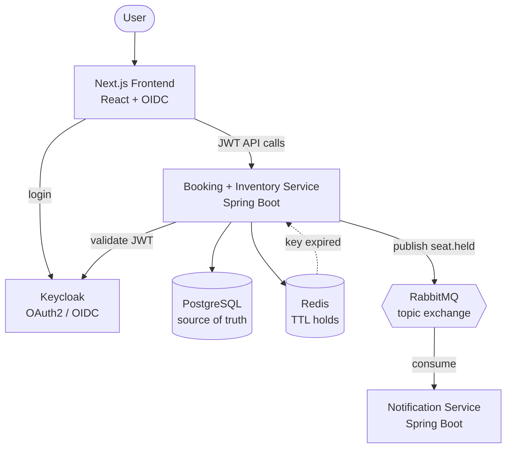

# ApexTick


> A distributed, real-time ticket reservation system built to survive a high-contention flash sale — where thousands of users race for the same seat and **exactly one** wins, with no double-booking and no slowdown.

ApexTick simulates the hardest moment in any ticketing platform: the instant a popular event goes on sale and a flood of requests collide on the same limited inventory. The whole system is designed around a single guarantee — **correctness under concurrency** — and that guarantee is *measured*, not assumed.

## Proven under load

A [k6](https://k6.io) test fires 5,000 hold attempts from 200 concurrent virtual users at an event with exactly 200 seats:

| Metric | Result |
| --- | --- |
| Concurrent virtual users | 200 |
| Total hold attempts | 5,000 |
| Seats available | 200 |
| **Holds won** | **200 / 200** |
| Holds correctly rejected | 4,800 |
| **Double-bookings** | **0** |
| Throughput | ~3,900 req/s |
| Latency (p95) | 146 ms |
| Latency (p99) | 224 ms |
| Failed requests | 0.00% |

Every seat was sold exactly once. Every losing request received a clean rejection. No seat was ever held by two people at the same time.

## Architecture



Two independent services share a message contract, not code:

- **Booking & Inventory Service** — the secured REST API. It claims seats atomically, records holds, publishes events, and manages hold expiry.
- **Notification Service** — a fully independent consumer that reacts to booking events asynchronously. It can restart or fail without affecting bookings.

Supporting infrastructure: **PostgreSQL** (the source of truth), **Redis** (self-expiring holds), **RabbitMQ** (the event bus), and **Keycloak** (OAuth2 / OIDC).

## How the concurrency works

The heart of the system is a single atomic statement:

```sql
UPDATE seats
   SET status = 'HELD',
       held_by = :userId,
       held_until = :expiry
 WHERE id = :seatId
   AND status = 'AVAILABLE';
```

When hundreds of requests target the same seat at once, they all run this `UPDATE`. PostgreSQL serializes them against that one row: the first to commit flips the seat to `HELD` and affects **1 row**; every other request now fails the `status = 'AVAILABLE'` condition and affects **0 rows**. The service simply reads the affected-row count — `1` means the seat is yours, `0` means it was already taken.

There are no `synchronized` blocks, no application-level mutexes, and no distributed locks. **The row in the database is the synchronization point**, which means the guarantee holds no matter how many copies of the service are running. This is the single most important decision in the project: *correctness lives in the shared database, not in any one JVM.*

## Engineering highlights

- **Lock-free atomic concurrency**, proven at 200/200 holds with zero double-bookings under load.
- **Self-expiring holds** — a held seat is written to Redis with a TTL. When the key expires, a Redis keyspace notification triggers the seat's release back to `AVAILABLE` — no polling loop on the happy path.
- **Event-driven decoupling** — the booking service publishes `seat.held` to a RabbitMQ topic exchange; the notification service consumes independently. Cross-service message deserialization works without shared code by relying on the consumer's inferred target type.
- **Stateless JWT security** — Keycloak issues OIDC tokens that the API validates statelessly. Auth keeps working even when the API runs containerized, by fetching signing keys over the internal Docker network while validating the public-facing issuer.
- **One-command infrastructure** — the backend and all infrastructure start with `docker compose up`, and every secret is externalized to a git-ignored `.env`.

## Tech stack

| Layer | Technology | Why |
| --- | --- | --- |
| Language | Java 21 | Virtual threads, records, modern language features |
| Framework | Spring Boot | Production-grade REST, security, data, and messaging |
| Database | PostgreSQL | ACID guarantees underpin the concurrency model |
| Migrations | Liquibase | Versioned, reviewable schema changes |
| Cache / TTL | Redis | Self-expiring holds via keyspace notifications |
| Messaging | RabbitMQ | Reliable, task-queue style event delivery |
| Auth | Keycloak | Standard OAuth2 / OIDC, portable across providers |
| Frontend | Next.js (React) | App Router, OIDC login, live seat map |
| Load testing | k6 | Scriptable concurrency and correctness verification |
| Containerization | Docker Compose | Reproducible, one-command environment |

## Getting started

### Prerequisites

- Docker Desktop
- Node.js 20+
- (Optional) [k6](https://k6.io), to run the load test

### 1. Clone and configure

```bash
git clone https://github.com/kalanas210/apextick.git
cd apextick
cp .env.example .env   # the defaults are fine for local development
```

### 2. Start the backend and infrastructure

```bash
docker compose up --build
```

This launches the Booking & Inventory Service together with PostgreSQL, Keycloak, RabbitMQ, and Redis.

### 3. Configure Keycloak (one-time)

Open the admin console at **http://localhost:8180** and sign in with the admin credentials from your `.env`.

1. Create a realm named **`apextick`**.
2. Create a **public** client **`apextick-web`** with:
   - Standard flow and Direct access grants enabled
   - Valid redirect URI: `http://localhost:3000/*`
   - Web origin: `http://localhost:3000`
   - Advanced → PKCE method: `S256`
3. Create a user in the realm and set a password.

### 4. Run the frontend

```bash
cd frontend
npm install
npm run dev
```

Open **http://localhost:3000**, log in, and book a seat.

### 5. (Optional) Run the notification service

To watch the asynchronous flow, run the notification service (from your IDE, or `./mvnw spring-boot:run` inside `notification-service/`). It consumes `seat.held` events and logs a notification for every hold.

## API documentation

Once the backend is running, the Booking & Inventory API serves interactive OpenAPI docs (Swagger UI) via [springdoc-openapi](https://springdoc.org) at **http://localhost:8081/swagger-ui.html**. Use the **Authorize** button to paste a Keycloak access token, then browse and try the secured endpoints directly from the browser.

## Running the load test

Seed an event with 200 available seats first, then run the k6 script:

```bash
# from load-test/
k6 run booking-load-test.js
```

The script reports holds won versus rejected and confirms that no seat is ever held twice — the same test that produced the numbers above.

## Project structure

```
apextick/
├── booking-service/        # Spring Boot — atomic seat claims, JWT-secured REST API
├── notification-service/   # Spring Boot — asynchronous RabbitMQ consumer
├── frontend/               # Next.js — seat map UI with OIDC login
├── load-test/              # k6 load + correctness test
├── docker-compose.yml      # Full stack: services + Postgres, Keycloak, RabbitMQ, Redis
└── .env.example            # Template for required environment variables
```

## Ports

| Service | URL / Port |
| --- | --- |
| Booking & Inventory API | http://localhost:8081 |
| Frontend | http://localhost:3000 |
| Keycloak | http://localhost:8180 |
| RabbitMQ management | http://localhost:15672 |
| PostgreSQL | localhost:5440 |
| Redis | localhost:6379 |

## Roadmap

- Containerize the notification service and frontend for a single-command full stack
- Automated Keycloak realm import to skip the manual setup
- API gateway (WSO2 API Manager) in front of the services
- CI pipeline (GitHub Actions) running the concurrency test on every push
- Infrastructure-as-code deployment (Terraform + AWS)

---

Built by [Kalana Sandakelum](https://github.com/kalanas210).